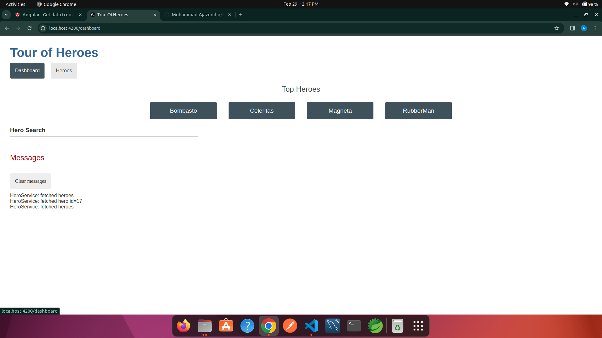
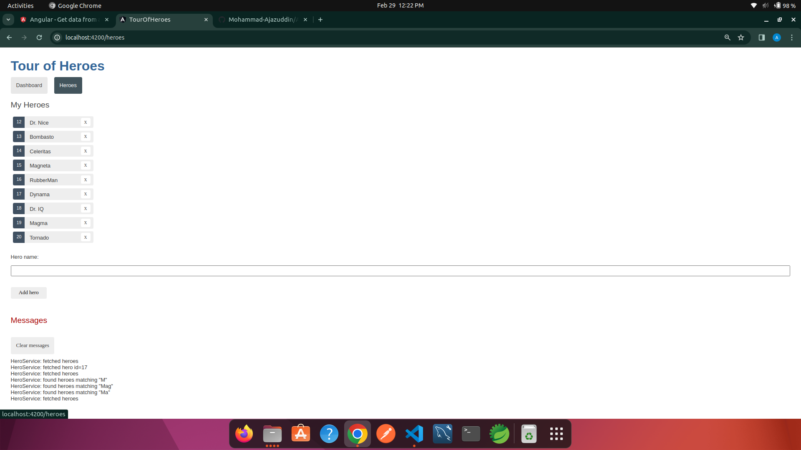
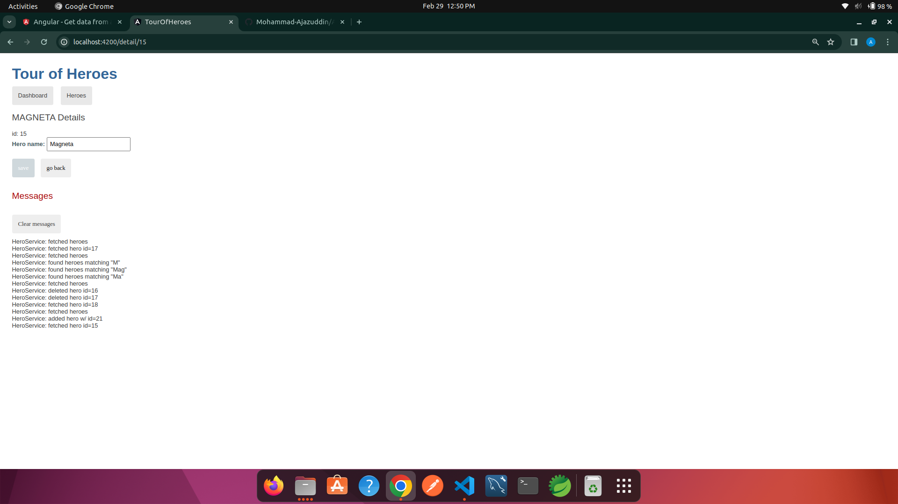
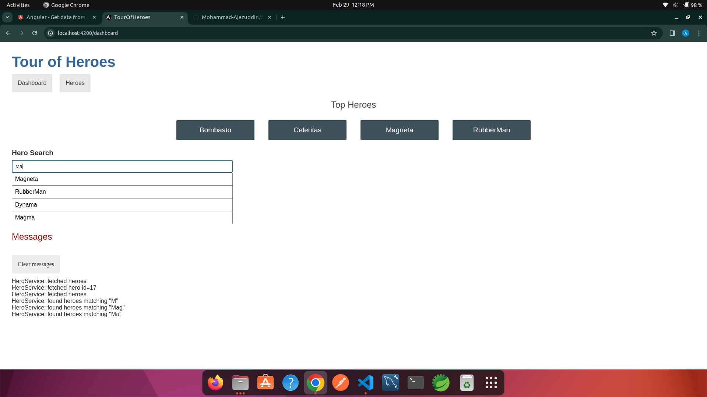
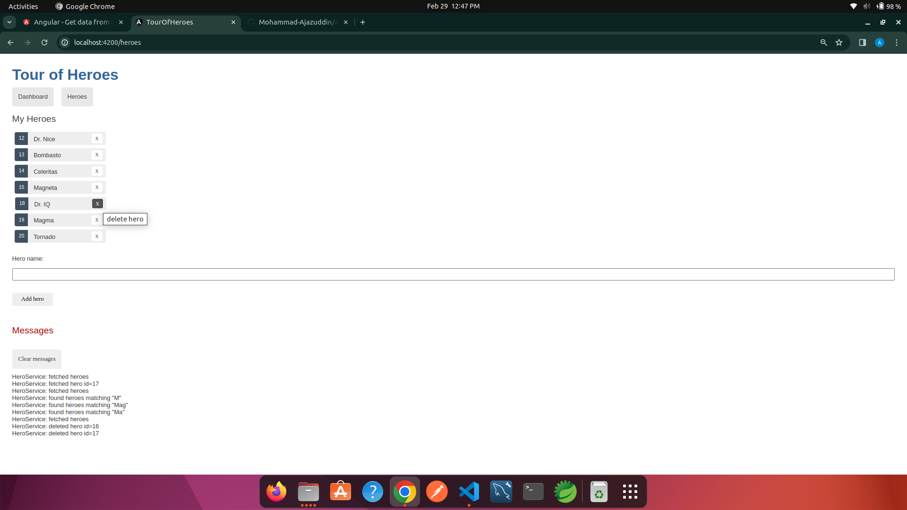

# Angular-TourOfHeroes
# Angular Tutorial 2
  Tour of heroes
  <a href="https://angular.io/tutorial/tour-of-heroes">https://angular.io/tutorial/tour-of-heroes</a>
   
  

  <h3>ScreenShots</h3>

